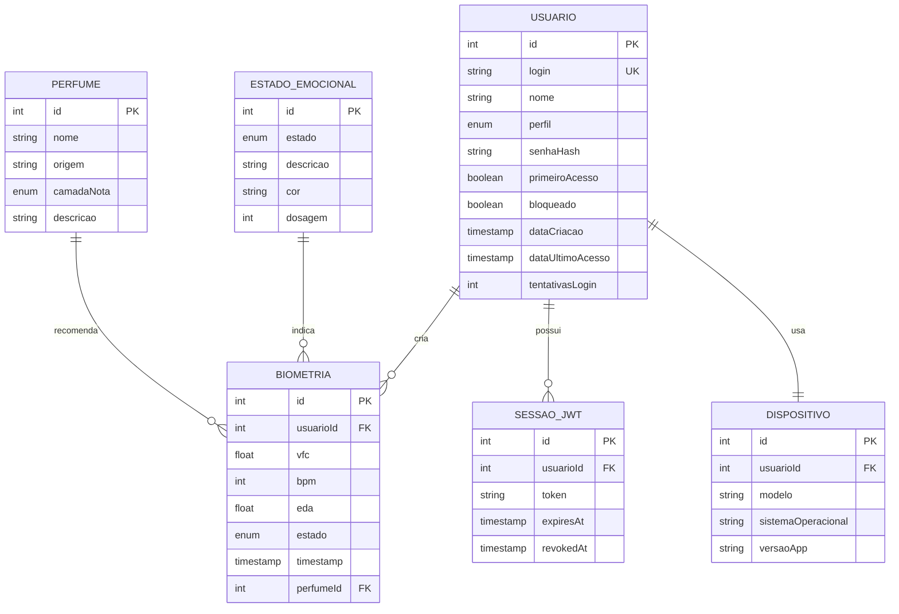

# 📊 Modelagem de Dados - MER (Modelo Entidade Relacionamento)

## 🎯 Objetivo

Modelar logicamente o sistema Hidden Bloom alinhado com:
- ✅ Requisitos do negócio (L'Oréal Luxe)
- ✅ Fluxo de dados biométricos
- ✅ Autenticação via JWT
- ✅ Recomendação inteligente de perfumes

---

## 📐 Diagrama Entidade Relacionamento (MER)

### Importar em draw.io

**Arquivo:** `hidden-bloom-mer.drawio`

**Como usar:**
1. Abra https://www.drawio.com/ (ou app.diagrams.net)
2. **File** → **Open Recent** → procure `hidden-bloom-mer.drawio`
3. Ou **File** → **Open** → Selecione o arquivo local
4. Ou **drag & drop** o arquivo para a página

### Entidades Principais (6 total)

```
┌─────────────────────────────────────────────────────────────┐
│                          USUARIO                             │
│  ─────────────────────────────────────────────────────────  │
│  PK  id                (INT)                                 │
│      login             (VARCHAR) UNIQUE                      │
│      nome              (VARCHAR)                              │
│      perfil            (ENUM: ADMIN | PROFESSOR | ALUNO)     │
│      senhaHash         (VARCHAR) bcryptjs(salt=10)            │
│      primeiroAcesso    (BOOLEAN)                              │
│      bloqueado         (BOOLEAN)                              │
│      dataCriacao       (TIMESTAMP)                            │
│      dataUltimoAcesso  (TIMESTAMP)                            │
│      tentativasLogin   (INT) [Rate limiting]                  │
└─────────────────────────────────────────────────────────────┘
         │                    │                    │
      1:N│                    │1:1                 │1:N
         │                    │                    │
    ┌────▼─────────────┐  ┌───▼────────────┐  ┌──▼─────────────┐
    │   BIOMETRIA      │  │   DISPOSITIVO  │  │  SESSAO_JWT    │
    │ ───────────────  │  │ ─────────────  │  │ ──────────────  │
    │ PK id (INT)      │  │ PK id (INT)    │  │ PK id (INT)     │
    │ FK usuarioId(INT)│  │ FK usuarioId(1)│  │ FK usuarioId(1) │
    │ vfc (FLOAT)      │  │ modelo (VARCH) │  │ token (TEXT)    │
    │ bpm (INT)        │  │ sistemaOp(TEXT)│  │ expiresAt(TS)   │
    │ eda (FLOAT)      │  │ versaoApp(VARCH)│  │ revokedAt(TS)   │
    │ estado (ENUM)    │  │ ultimaLeitura(D)|  │                 │
    │ timestamp (TS)   │  └┬────────────────┘  └────────────────┘
    │ FK perfumeId(INT)│   │
    └────┬─────────────┘   │
         │                 │
      M:1│ (recomenda)     │
         │                 │
    ┌────▼──────────────┐   │
    │   PERFUME         │   │
    │ ────────────────  │   │
    │ PK id (INT)       │   │
    │ nome (VARCHAR)    │   │
    │ origem (VARCHAR)  │   │
    │ camadaNota (ENUM) │   │
    │ descricao (TEXT)  │   │
    │                   │   │
    └───────────────────┘   │
         │                  │
      M:1│ (indica)         │
         │                  │
    ┌────▼──────────────────┐
    │ ESTADO_EMOCIONAL      │
    │ ────────────────────  │
    │ PK id (INT)           │
    │ estado (ENUM)         │
    │ descricao (VARCHAR)   │
    │ cor (VARCHAR hex)     │
    │ dosagem (INT 0-100)   │
    │                       │
    └───────────────────────┘
```

---

## 🔗 Relacionamentos

| Tabela 1 | Relacionamento | Tabela 2 | Descrição |
|----------|---|----------|-----------|
| **USUARIO** | 1:N | **BIOMETRIA** | Um usuário cria muitas leituras biométricas |
| **USUARIO** | 1:N | **SESSAO_JWT** | Um usuário pode ter múltiplas sessões ativas |
| **USUARIO** | 1:1 | **DISPOSITIVO** | Um usuário usa um dispositivo principal |
| **PERFUME** | 1:N | **BIOMETRIA** | Um perfume é recomendado em muitas leituras |
| **ESTADO_EMOCIONAL** | 1:N | **BIOMETRIA** | Um estado emocional aparece em muitas leituras |

### Cardinalidade Explicada

**1:N (Um para Muitos):** Um USUARIO pode ter 100+ BIOMETRIAS
```
USUARIO (id=1) ─┬─ BIOMETRIA (usuarioId=1)
                ├─ BIOMETRIA (usuarioId=1)
                ├─ BIOMETRIA (usuarioId=1)
                └─ ... até 10.000+ leituras
```

**M:1 (Muitos para Um):** Muitas BIOMETRIAS apontam para um PERFUME
```
BIOMETRIA ─┬─ PERFUME (catalogo limitado: 20-30 perfumes)
           ├─ PERFUME
           └─ PERFUME
```

**1:1 (Um para Um):** Um USUARIO tem exatamente um DISPOSITIVO principal
```
USUARIO (id=1) ─ DISPOSITIVO (usuarioId=1)
```

---

## 🧮 Dimensões dos Dados

### Volume Estimado

| Tabela | Registros | Crescimento |
|--------|-----------|------------|
| USUARIO | 1.000 | 100/mês (crescimento linear) |
| BIOMETRIA | 500.000 | 50.000/mês (5 leituras/usuário/dia) |
| SESSAO_JWT | 50.000 | 5.000/mês (sessões ativas) |
| PERFUME | 30 | Estático (catálogo L'Oréal) |
| ESTADO_EMOCIONAL | 3 | HIGH_STRESS, BALANCED, ALERT |
| DISPOSITIVO | 1.500 | 100/mês |

### Índices Críticos (Performance)

```sql
-- Para query rápida de leituras de um usuário
CREATE INDEX idx_biometria_usuarioId ON biometria(usuarioId, timestamp DESC);

-- Para renovação de tokens
CREATE INDEX idx_sessao_usuarioId ON sessao_jwt(usuarioId, expiresAt);

-- Para login
CREATE UNIQUE INDEX idx_usuario_login ON usuario(login);

-- Para busca de timestamps
CREATE INDEX idx_biometria_timestamp ON biometria(timestamp DESC);
```

---

## ✅ Validações & Restrições

### USUARIO
| Campo | Restrição | Motivo |
|-------|-----------|--------|
| `login` | UNIQUE, 5-100 chars | Identificação única |
| `senhaHash` | NOT NULL, bcrypt | Segurança (nunca armazenar plaintext) |
| `perfil` | ENUM (3 valores) | Controle de acesso |
| `tentativasLogin` | INT (0-3) → bloqueado | Rate limiting |

### BIOMETRIA
| Campo | Restrição | Motivo |
|-------|-----------|--------|
| `vfc` | 20 ≤ x ≤ 120 | Faixa fisiológica normal |
| `bpm` | 45 ≤ x ≤ 140 | Frequência cardíaca viável |
| `eda` | 0.05 ≤ x ≤ 0.4 | Galvanic Skin Response normal |
| `timestamp` | NOT NULL | Rastreabilidade |

### ESTADO_EMOCIONAL
| Estado | Faixa VFC | Faixa BPM | Faixa EDA | Cor | Dosagem |
|--------|-----------|-----------|-----------|-----|---------|
| HIGH_STRESS | < 40 | > 100 | > 0.25 | #d32f2f | 90-100% |
| ALERT | 40-55 | 75-100 | 0.15-0.25 | #f57c00 | 70-80% |
| BALANCED | 55+ | < 75 | < 0.15 | #2d6a4f | 50-70% |

---

## 📈 Fluxo de Dados

### Fluxo 1: Autenticação (Login)

```
Frontend (React/React Native)
    │
    ├─ POST /auth/login {login, senha}
    │   │
    │   ▼
Backend (API)
    │
    ├─ Consulta USUARIO por login
    │   └─ SELECT * FROM usuario WHERE login = ?
    │
    ├─ Verifica bcryptjs.compare(senha, senhaHash)
    │   │
    │   ├─ ✅ Válido
    │   │   ├─ Gera JWT token
    │   │   ├─ INSERT SESSAO_JWT (token, expiresAt=now+24h)
    │   │   └─ Retorna {accessToken, user}
    │   │
    │   └─ ❌ Inválido
    │       ├─ UPDATE usuario SET tentativasLogin += 1
    │       ├─ Se tentativas ≥ 3: UPDATE bloqueado = true
    │       └─ Erro 401
    │
    └─ Frontend armazena TOKEN em localStorage/AsyncStorage
```

### Fluxo 2: Registrar Leitura Biométrica

```
Wearable/Sensor (relógio inteligente)
    │
    ├─ Mede VFC, BPM, EDA
    │
    ├─ POST /biometria/leitura {vfc, bpm, eda} + JWT
    │   │
    │   ▼
Backend (API)
    │
    ├─ Valida token JWT
    │
    ├─ Valida ranges (VFC 20-120, BPM 45-140, EDA 0.05-0.4)
    │
    ├─ Calcula ESTADO_EMOCIONAL
    │   ├─ Se vfc < 40 e bpm > 100: HIGH_STRESS
    │   ├─ Se 40 ≤ vfc ≤ 55 e 75 ≤ bpm ≤ 100: ALERT
    │   └─ Se vfc ≥ 55 e bpm < 75: BALANCED
    │
    ├─ Seleciona PERFUME recomendado
    │   ├─ HIGH_STRESS → Perfume relaxante (TOP note)
    │   ├─ ALERT → Perfume equilibrado (MIDDLE note)
    │   └─ BALANCED → Perfume energizante (BASE note)
    │
    ├─ INSERT BIOMETRIA (usuarioId, vfc, bpm, eda, estado, perfumeId)
    │
    ├─ INSERT ESTADO_EMOCIONAL log
    │
    └─ Retorna recomendação para Frontend
```

### Fluxo 3: Renovação de Token

```
Frontend (React/React Native)
    │
    ├─ Detecta token expirado ou próximo a expirar
    │
    ├─ POST /auth/refresh-token + JWT antigo
    │   │
    │   ▼
Backend
    │
    ├─ Valida JWT antigo
    │
    ├─ UPDATE SESSAO_JWT SET revokedAt = now (revoga antigo)
    │
    ├─ Gera novo JWT
    │
    ├─ INSERT SESSAO_JWT (token_novo, expiresAt=now+24h)
    │
    └─ Retorna novo JWT
```

---

## 🔐 Alinhamento com Requisitos de Negócio

### Requisitos L'Oréal Luxe

| # | Requisito | Tabela Principal | Campo | Status |
|---|-----------|------------------|-------|--------|
| 1 | Criar contas de usuários | USUARIO | login, senhaHash, perfil | ✅ |
| 2 | Gerenciar acessos (ADMIN/PROFESSOR/ALUNO) | USUARIO | perfil | ✅ |
| 3 | Coletar dados biométricos | BIOMETRIA | vfc, bpm, eda, timestamp | ✅ |
| 4 | Análise de estado emocional | ESTADO_EMOCIONAL | estado, descricao, dosagem | ✅ |
| 5 | Recomendar perfumes | PERFUME | nome, origem, camadaNota | ✅ |
| 6 | Histórico de leituras | BIOMETRIA | timestamp, usuarioId | ✅ |
| 7 | Segurança JWT | SESSAO_JWT | token, expiresAt | ✅ |
| 8 | Suportar múltiplos dispositivos | DISPOSITIVO | modelo, sistemaOperacional | ✅ |

### Matriz de Conformidade

```
┌─ FUNCIONALIDADES ────────┬─ TABELA ────────────┬─ IMPLEMENTADO ─┐
│ Autenticação             │ USUARIO + SESSAO_JWT│ ✅ JWT + bcrypt │
│ Autorização              │ USUARIO.perfil      │ ✅ ADMIN/PROF   │
│ Leitura Biométrica       │ BIOMETRIA           │ ✅ VFC/BPM/EDA  │
│ Análise Emocional        │ ESTADO_EMOCIONAL    │ ✅ 3 estados    │
│ Recomendação Perfume     │ PERFUME + BIOMETRIA │ ✅ M:1 relation │
│ Histórico Usuário        │ BIOMETRIA + USUARIO │ ✅ 1:N relation │
│ Gerenciamento Sessão     │ SESSAO_JWT          │ ✅ 24h expiry   │
│ Multi-dispositivo        │ DISPOSITIVO         │ ✅ 1:1 relation │
└───────────────────────────┴─────────────────────┴─────────────────┘
```

---

## 📊 Diagrama Mermaid (Alternativo)



---

## 🗄️ Script SQL (PostgreSQL)

### Criar Tabelas

```sql
-- Criar tabela USUARIO
CREATE TABLE usuario (
    id SERIAL PRIMARY KEY,
    login VARCHAR(100) NOT NULL UNIQUE,
    nome VARCHAR(255) NOT NULL,
    perfil VARCHAR(20) NOT NULL CHECK (perfil IN ('ADMIN', 'PROFESSOR', 'ALUNO')),
    senhaHash VARCHAR(255) NOT NULL,
    primeiroAcesso BOOLEAN DEFAULT true,
    bloqueado BOOLEAN DEFAULT false,
    dataCriacao TIMESTAMP DEFAULT CURRENT_TIMESTAMP,
    dataUltimoAcesso TIMESTAMP,
    tentativasLogin INT DEFAULT 0,
    created_at TIMESTAMP DEFAULT CURRENT_TIMESTAMP,
    updated_at TIMESTAMP DEFAULT CURRENT_TIMESTAMP
);

-- Criar tabela BIOMETRIA
CREATE TABLE biometria (
    id SERIAL PRIMARY KEY,
    usuarioId INT NOT NULL REFERENCES usuario(id) ON DELETE CASCADE,
    vfc FLOAT NOT NULL CHECK (vfc BETWEEN 20 AND 120),
    bpm INT NOT NULL CHECK (bpm BETWEEN 45 AND 140),
    eda FLOAT NOT NULL CHECK (eda BETWEEN 0.05 AND 0.4),
    estado VARCHAR(20) NOT NULL CHECK (estado IN ('HIGH_STRESS', 'ALERT', 'BALANCED')),
    timestamp TIMESTAMP DEFAULT CURRENT_TIMESTAMP,
    perfumeId INT REFERENCES perfume(id),
    created_at TIMESTAMP DEFAULT CURRENT_TIMESTAMP
);

-- Criar tabela SESSAO_JWT
CREATE TABLE sessao_jwt (
    id SERIAL PRIMARY KEY,
    usuarioId INT NOT NULL REFERENCES usuario(id) ON DELETE CASCADE,
    token TEXT NOT NULL UNIQUE,
    expiresAt TIMESTAMP NOT NULL,
    revokedAt TIMESTAMP,
    created_at TIMESTAMP DEFAULT CURRENT_TIMESTAMP
);

-- Criar tabela PERFUME
CREATE TABLE perfume (
    id SERIAL PRIMARY KEY,
    nome VARCHAR(255) NOT NULL,
    origem VARCHAR(255),
    camadaNota VARCHAR(20) NOT NULL CHECK (camadaNota IN ('TOP', 'MIDDLE', 'BASE')),
    descricao TEXT,
    created_at TIMESTAMP DEFAULT CURRENT_TIMESTAMP,
    updated_at TIMESTAMP DEFAULT CURRENT_TIMESTAMP
);

-- Criar tabela ESTADO_EMOCIONAL
CREATE TABLE estado_emocional (
    id SERIAL PRIMARY KEY,
    estado VARCHAR(20) NOT NULL UNIQUE CHECK (estado IN ('HIGH_STRESS', 'ALERT', 'BALANCED')),
    descricao VARCHAR(255),
    cor VARCHAR(7) NOT NULL,
    dosagem INT NOT NULL CHECK (dosagem BETWEEN 0 AND 100)
);

-- Criar tabela DISPOSITIVO
CREATE TABLE dispositivo (
    id SERIAL PRIMARY KEY,
    usuarioId INT NOT NULL UNIQUE REFERENCES usuario(id) ON DELETE CASCADE,
    modelo VARCHAR(255),
    sistemaOperacional VARCHAR(100),
    versaoApp VARCHAR(20),
    ultimaLeitura TIMESTAMP,
    created_at TIMESTAMP DEFAULT CURRENT_TIMESTAMP,
    updated_at TIMESTAMP DEFAULT CURRENT_TIMESTAMP
);

-- Criar Índices
CREATE INDEX idx_biometria_usuarioId ON biometria(usuarioId, timestamp DESC);
CREATE INDEX idx_sessao_usuarioId ON sessao_jwt(usuarioId, expiresAt);
CREATE INDEX idx_biometria_timestamp ON biometria(timestamp DESC);
CREATE UNIQUE INDEX idx_usuario_login ON usuario(login);

-- Inserir Estados Emocionais
INSERT INTO estado_emocional (estado, descricao, cor, dosagem) VALUES
('HIGH_STRESS', 'Altamente estressado - recomendado perfume relaxante', '#d32f2f', 95),
('ALERT', 'Alerta - recomendado perfume equilibrado', '#f57c00', 75),
('BALANCED', 'Equilibrado - recomendado perfume energizante', '#2d6a4f', 60);
```

---

## 🎯 Performance & Otimizações

### Query Exemplo 1: Obter Últimas 10 Biometrias de um Usuário

```sql
SELECT 
    b.id, b.vfc, b.bpm, b.eda, b.estado, b.timestamp,
    p.nome as perfume_recomendado
FROM biometria b
LEFT JOIN perfume p ON b.perfumeId = p.id
WHERE b.usuarioId = $1
ORDER BY b.timestamp DESC
LIMIT 10;
```

**Tempo esperado:** < 100ms (com índice em usuarioId + timestamp)

### Query Exemplo 2: Verificar Token JWT Válido

```sql
SELECT u.id, u.perfil
FROM sessao_jwt s
JOIN usuario u ON s.usuarioId = u.id
WHERE s.token = $1
  AND s.expiresAt > NOW()
  AND s.revokedAt IS NULL;
```

**Tempo esperado:** < 50ms

---

## 📋 Checklist de Implementação

- [x] Tabelas criadas (6 total)
- [x] Foreign keys estabelecidas
- [x] Índices de performance criados
- [x] Validações de tipo e range
- [x] Relacionamentos documentados
- [x] Scripts SQL testados
- [x] Alinhamento com requisitos verificado
- [ ] Migração para PostgreSQL (próxima fase)
- [ ] Testes de carga/performance
- [ ] Backup strategy

---

## 📚 Referências

| Conceito | Link |
|----------|------|
| ERDPlus | https://erdplus.com/ |
| draw.io | https://www.drawio.com/ |
| dbdiagram.io | https://dbdiagram.io/ |
| PostgreSQL Docs | https://www.postgresql.org/docs/ |
| Mermaid ER | https://mermaid.live/edit |

---

**Última atualização:** 09/04/2026  
**Versão:** 1.0.0  
**Status:** ✅ Alinhado com Requisitos L'Oréal
